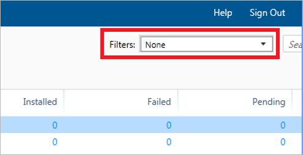
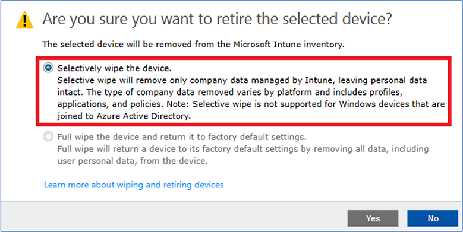

---
# required metadata

title: Considerations when managing Windows devices with Intune on Azure
description: Considerations when using Intune on Azure to manage your organization’s Windows devices.
keywords:
author: ErikjeMS
ms.author: erikje
manager: dougeby
ms.date: 11/14/2017
ms.topic: article
ms.prod:
ms.service: microsoft-intune
ms.technology:
ms.assetid: 

# optional metadata

#audience:
#ms.devlang:
ms.reviewer: owenyen
ms.suite: ems
#ms.tgt_pltfrm:
ms.custom: intune-classic

---

# Intune on Azure console and legacy Intune PC Client

Intune recently moved to an Azure-based SaaS application service architecture. Azure provides significant improvements in scale, capacity, and performance. This transition also offers enhanced Intune admin experiences and optimized workflows in the Azure portal. 

When using Intune on Azure to manage your organization’s Windows devices, consider the following points:

## Legacy PC Client features are only available in the Silverlight console

The Intune PC Client management workflows use the [Silverlight-based Intune Admin Console](https://manage.microsoft.com/), which has the following consequences:

- For all non-grouping management tasks using the Intune PC Client, you must use the Silverlight console.
- When managing groups, you must use the [Intune on Azure portal](https://portal.azure.com/). This requirement exists because Intune now uses Azure AD Groups instead of legacy Intune Groups. 

Because of the switch to Azure AD Groups, “group-based” filtering in the Silverlight console dashboard views has changed slightly. To filter in the updated Silverlight UI, follow these steps:

1. Select a view.
2. In the **Filters** box, enter the name of the group that you want to filter by and press enter. This will filter the list view to the devices in that particular group.

   

## Manage Windows 10 devices by using MDM

We recommend that you use [Mobile Device Management (MDM) to manage your Windows 10 devices](https://docs.microsoft.com/intune/device-restrictions-windows-10) instead of using the legacy Intune PC client. The ability to manage Windows 10 via MDM is available in the Intune on Azure portal. Windows 10 MDM provides many new management and security capabilities that are not available via the legacy Intune PC client.

## Continue to manage Windows 7 by using Intune PC Client

For Windows 7, which can’t be managed by using MDM, we will continue to support existing Intune PC Client capabilities in the Silverlight console only. Consider migrating to MDM management when you upgrade to Windows 10.

## MDM Capabilities

For a detailed comparison between PC Client and MDM capabilities, see [Compare managing Windows PCs as computers or mobile devices](https://docs.microsoft.com/intune-classic/deploy-use/pc-management-comparison). MDM updates will continue to bring new management capabilities to MDM-enrolled, Windows 10 devices, inclusive of evaluating options for Win 32 apps. View the [What’s New](https://docs.microsoft.com/intune/whats-new) for the latest release additions to the service.

## Switch from PC Client to MDM

To switch from managing Windows 10 devices with the Intune PC Client to managing with MDM, follow these steps:

1. In the Silverlight console, perform a **Selective wipe** to un-enroll the device from the PC Client.
  
2. Re-enroll the device by using [MDM (and/or Azure AD Join)](https://docs.microsoft.com/intune/windows-enroll). 

## Next steps
[Enroll Windows devices](https://docs.microsoft.com/intune/windows-enroll)

 
